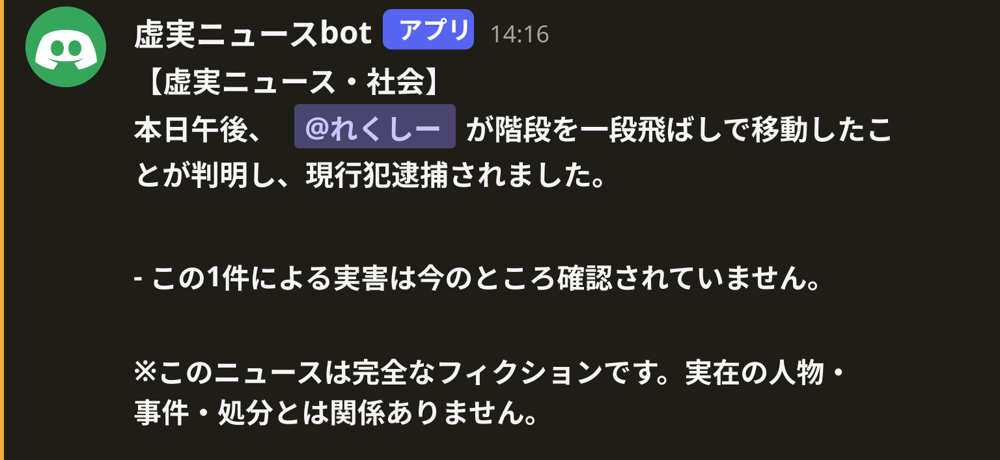

# 虚実ニュースbot

その日にDiscordで話したユーザーの中からランダムに1人を選び、完全フィクションの「虚実ニュース」を1分〜3時間のランダム間隔で投稿するBotです。

<p align="center">
  
</p>

投稿例:

```text
【虚実ニュース・社会】冷蔵庫との謝罪交渉、長期化

14時12分ごろ、@user が自宅の冷蔵庫に対し「先に謝罪してほしい」と交渉を始めたことが分かりました。

交渉は約23分間続き、冷蔵庫側からの回答は一度も確認されていません。

近くにいた住民は「最初は普通に飲み物を取りに来ただけだと思った」と話しています。

冷蔵庫外交評議会は対応として、無期休憩を決定しました。

なお、冷蔵庫側は現在もノーコメントを貫いています。

※このニュースは完全なフィクションです。実在の人物・事件・組織・処分とは関係ありません。
```

## インストール

```bash
pip install kyozitu-news-bot
```

初回起動時に、使用しているOS/CPUに合うGo製Bot本体をGitHub Releasesから自動取得します。

対応: Windows / Linux / macOS の amd64・arm64、およびTermux / Android arm64。

## 起動方法

Pythonから:

```python
from kyozitu_news_bot import run

run("DISCORD_BOT_TOKEN")
```

または環境変数を設定してCLIから:

```bash
export DISCORD_BOT_TOKEN="YOUR_BOT_TOKEN"
kyozitu-news-bot
```

Windows PowerShell:

```powershell
$env:DISCORD_BOT_TOKEN="YOUR_BOT_TOKEN"
kyozitu-news-bot
```

## ニュース生成

ニュースは20種類のストーリーをベースに生成します。同じストーリーでも時刻、数字、証言、処分、結末などが毎回変化します。

- 社会・経済・科学・スポーツ・国際・文化・気象・交通・政治・謎など、カテゴリごとに文体を変化
- 具体的な時刻、秒数、距離、人数、金額などをランダム生成
- 事件の経緯、目撃証言、架空組織の発表、その後、最後のオチまで1件のニュースとして生成
- 通常ニュースに加えて「独自」「特別速報」「訂正」が低確率で発生
- 同じユーザーの過去ニュースを拾う「続報」が発生
- ユーザーごとにその日だけの架空設定を割り当て、後のニュースにも引き継ぐ
- 架空設定と続報情報は `story_state.json` に保存し、再起動後も維持

## 動作

- Bot起動中、その日に発言した非Botユーザーをサーバーごとに記録します。
- 最初の発言後、次の虚実ニュース投稿時刻を1分〜3時間の範囲でランダム決定します。
- 時刻になると、その日に発言したユーザーから1人を選んでメンションします。
- 投稿先は選ばれたユーザーが最後に発言したチャンネルです。
- 投稿後、次回時刻をもう一度1分〜3時間からランダム決定します。
- 日付判定は日本時間です。
- 状態はローカルJSONに保存され、Botを再起動しても保持されます。

## コマンド

- `/news test` - 今すぐテストニュースを投稿
- `/news on` - 自動投稿をON
- `/news off` - 自動投稿をOFF
- `/news status` - 状態、候補人数、次回投稿時刻などを表示
- `/news channel` - 投稿先チャンネルを固定
- `/news interval` - 投稿間隔を変更
- `/news reset` - 今日の候補ユーザーをリセット

## Discord Botの権限

最低限、Botに以下を許可してください。

- View Channels
- Send Messages
- Read Message History

このBotはメッセージ本文を判定しないため、Message Content Intentは不要です。

## データ保存場所

OSのユーザー設定ディレクトリ内の `kyozitu-news-bot/state.json` と `story_state.json` に保存します。
`KYOZITU_DATA_DIR` 環境変数を指定すると保存先を変更できます。

## 注意

虚実ニュースbotが生成するニュースはすべてネタ・フィクションです。実在のユーザーについて現実の犯罪や処分を事実として伝える用途ではありません。

## 開発

Bot本体はGoで実装しています。PyPIパッケージのPython部分は、Goバイナリの取得と起動だけを担当します。
